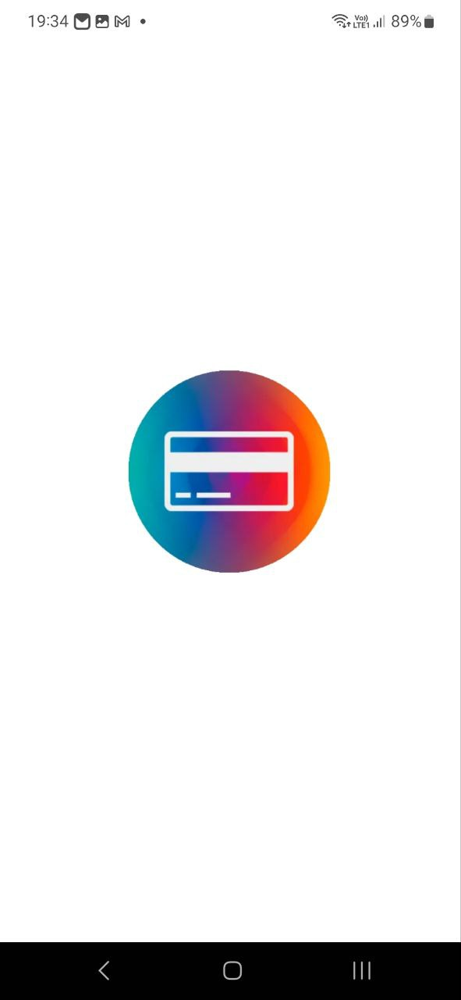
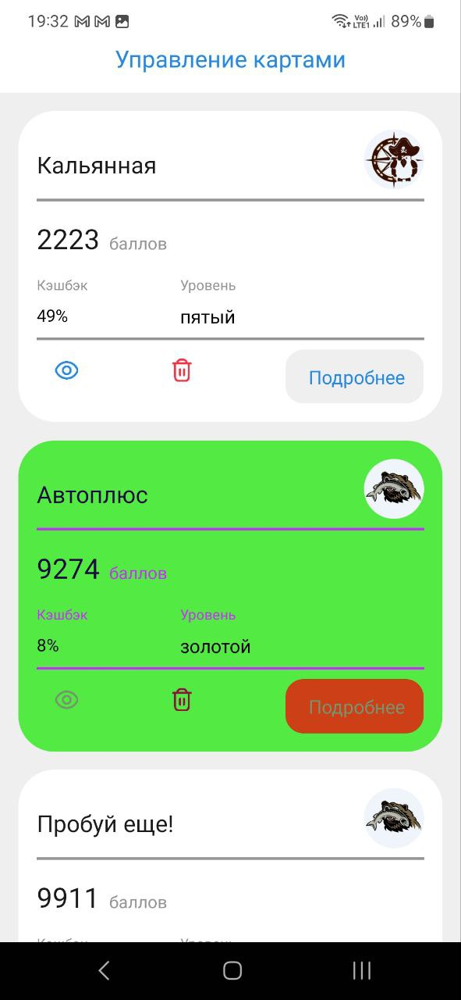

# проект выполнен в react native для мобильных устройств
## превью проекта




запуск проекта
```sh
npx expo start
```
можно сканировать с помощью expo go - qr код 

по ссылке [expo qr](https://expo.dev/preview/update?message=Initial%20update%20for%20preview&updateRuntimeVersion=1.0.0&createdAt=2024-04-12T12%3A02%3A11.660Z&slug=exp&projectId=ba894ef3-a368-499f-83aa-05948ed177b6&group=d04d7dbf-ed2e-45aa-a8b1-ad4b8c15615e)
